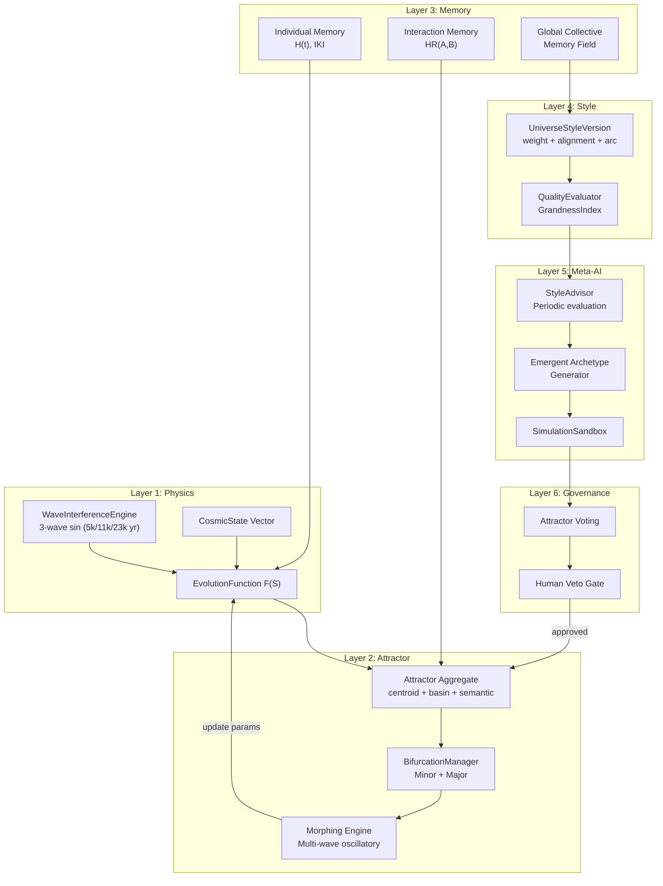

# RFC: Deterministic Civilization Engine (DCE)

**Version**: 1.0 — Architectural Baseline  
**Status**: Draft  
**Stack**: Laravel 12 (Backend) + Next.js (Frontend)  
**Owner**: Human Sovereign  
**Date**: 2026-02-13

---

## 1. Abstract

Hệ thống mô phỏng văn minh deterministic, multi-layer, với:
- **Physics kernel** tạo biến đổi
- **Memory layer** tạo quán tính lịch sử
- **Collective field** tạo khí chất thời đại
- **Controlled emergence** sinh archetype mới
- **Hybrid governance** (AI propose + attractor vote + human veto)

> [!IMPORTANT]
> **Nguyên tắc tối thượng**: Physics không bao giờ bị memory override trực tiếp. Memory chỉ bias parameters → gián tiếp ảnh hưởng dynamics.

---

## 2. Core Principles

| # | Nguyên tắc | Giải thích |
|---|-----------|-----------|
| 1 | **Determinism** | `S(t+1) = F(S(t), params)` — cùng input → cùng output |
| 2 | **Memory = bias, not override** | Memory chỉ điều chỉnh tham số, không can thiệp F(S) |
| 3 | **Emergence qua constraint** | Mọi proposal phải pass 4 constraint checks |
| 4 | **World persistent** | Timeline bất biến, không rewrite quá khứ |
| 5 | **Style = future only** | Style update chỉ ảnh hưởng epoch tiếp theo |
| 6 | **AI = tay sai** | AI đề xuất, không áp dụng — human veto tối hậu |
| 7 | **Chaos = lực tái cấu trúc** | Chaos không phá hủy, mà ép Order tự cải tổ |

---

## 3. System Architecture (6 Layers)



---

## 4. RFC-002: Mathematical Formalization

### 4.1 State Vector

```
S(t) = [E, H, T, S, R, I, X] ∈ [0,1]⁷
```

| Dim | Tên | Ý nghĩa | Thấp → Cao |
|-----|-----|---------|------------|
| **E** | Energy Density | Driver mutation | Tĩnh, phong kiến → Magic overflow, cyber-tech |
| **H** | Entropy Gradient | Tốc độ thay đổi | Lịch sử chậm → Loạn thế, dystopia |
| **T** | Tension / Strain | Áp lực nội tại | Yên bình → Fracture trigger |
| **S** | Structural Stability | Khả năng chịu dao động | Dễ vỡ → Bền vững |
| **R** | Resonance Coherence | Đồng pha tập thể | Phân tán → Tông môn, AI hive |
| **I** | Information Density | Tích lũy cấu trúc thông tin | Primal → Cyberpunk, tiên đạo |
| **X** | Transcendence Potential | Khả năng vượt attractor | Bình thường → Độ kiếp cosmic |

### 4.2 Cosmic Driver (Quasi-Periodic)

3 sóng Non-Commensurate → không lặp lại trong hàng triệu năm:

```
W₁ = sin(2πt / 5000)    // Amplitude 0.35
W₂ = sin(2πt / 11000)   // Amplitude 0.25  
W₃ = sin(2πt / 23000)   // Amplitude 0.15

W(t) = 0.5·W₁ + 0.3·W₂ + 0.2·W₃
```

### 4.3 Evolution Equations

**Tuned coefficients** (baseline v1 — ổn định + emergent):

```
Energy:       E(t+1) = clamp(E + 0.015·W(t) + 0.020·R - 0.018·H)
Entropy:      H(t+1) = clamp(H + 0.020·T - 0.025·S + 0.010·|W(t)|)
Tension:      T(t+1) = clamp(T + 0.030·(E-S) + 0.015·H)
Stability:    S(t+1) = clamp(S + 0.025·R - 0.030·T - 0.015·H)
Resonance:    R(t+1) = clamp(R + 0.020·(E·S) - 0.020·H)
Information:  I(t+1) = clamp(I + 0.018·R - 0.015·H)
Transcendence: X(t+1) = clamp(X + 0.010·T·H·(1-S))
```

**Deterministic noise** (để tránh symmetry chết):

```
noise = fract(sin(hash(world_seed + t)) × 43758.5453) × 0.002
```

Thêm vào E và T.

### 4.4 Attractor Formalization

Mỗi attractor `i`:
- Centroid `Cᵢ ∈ [0,1]⁷`
- Basin radius `rᵢ`
- Curvature factor
- Rigidity threshold `θᵢ`
- Recovery rate `ρᵢ`

**Distance & Influence**:

```
dᵢ = ||S - Cᵢ||₂

wᵢ = max(0, 1 - dᵢ/rᵢ)      (chỉ khi dᵢ ≤ rᵢ)

ŵᵢ = wᵢ / Σwⱼ               (normalized)
```

**Attractor pull trong F(S)**:

```
S(t+1) += Σ ŵᵢ · (Cᵢ - S(t)) · αᵢ + StyleBias + MemoryBias + Noise(ε)
```

### 4.5 Predefined Attractor Zones

| Code | Tên | Vector Profile | Genre |
|------|-----|---------------|-------|
| `EQUILIBRIUM` | Thiên Hòa | E↓ H↓ S↑ T↓ | Cổ đại, võ đạo sơ khai |
| `HIGH_CHAOS` | Thiên Loạn | H↑ T↑ S↓ | Ma Đạo, tận thế |
| `RESONANCE_DOMINANT` | Thiên Minh | E↑ R↑ S↑ H↓ | Cửu Trọng Thiên |
| `VOID_COLLAPSE` | Thiên Diệt | E↓ S↓ H↑ | Hư không, tái sinh |
| `EMERGENT_*` | Thiên Biến | Derived from state | Chế độ mới chưa từng tồn tại |

### 4.6 Chaos Trigger Index (CTI)

```
CTI = k₁·E + k₂·R² - k₃·A + k₄·HistoricalBias
```

Chaos khi `CTI > τ` (threshold phụ thuộc recovery capacity R).

### 4.7 Multi-Wave Oscillatory Morphing

Khi CTI vượt ngưỡng, attractor **không bị xóa** mà **lột xác**:

```
Δcentroid(t) = A(t) · direction_vector
A(t) = base_amplitude · sin(ωt) · exp(-λt)    // damped oscillation
```

Phase kết thúc khi: `|Δcentroid| < ε AND CTI < recovery_threshold`

Semantic vector trượt dần: `semantic(t+1) = lerp(old, projected, α_small)`

### 4.8 Rebirth Gain

```
RG = (OrderDominance_after - OrderDominance_before) / ChaosDuration
```

**Constraint**: Chaos chỉ được coi là "thành công" khi `RG > 0` (Order mạnh hơn trước).

### 4.9 Safety Bounds

| Constraint | Giới hạn |
|------------|---------|
| Historical influence | ≤ 25% total dynamics |
| GCMF bias | ≤ 25% total dynamics |
| HR interaction influence | ≤ 30% interaction force |
| Voting cap per attractor | ≤ 15% |
| Emergent archetype | ≤ 1 per epoch |
| Min chaos presence | 12% |
| Max chaos presence | 30% |
| Semantic alignment weight | Σ(w₆,w₇,w₈) ≤ 30% total Q |

---

## 5. Memory Architecture

### 5.1 Individual Memory (Historical Inertia Vector)

```
H(t+1) = λ·H(t) + EventVector       // λ ∈ [0.97, 0.995]
MemoryBias = γ·H
||MemoryBias|| ≤ 0.25
```

Thành phần:
- `cumulative_rebirth_gain`
- `cumulative_instability`
- `morph_intensity_history`

Derived metrics:
- **Identity Karma Index (IKI)** = `weighted_sum(morph_intensity, RG_history)`
- IKI cao → dễ đạt grandness cao → nhưng chaos khi đến sẽ sâu hơn

### 5.2 Interaction Memory

```
HR(A,B) = w₁·shared_survival - w₂·conflict_intensity + w₃·rebirth_alignment
```

`|HR| ≤ 0.3` — Memory là bias, không phải định mệnh.

Interaction force: `F(A,B) = BaseForce · (1 + HR(A,B))`

### 5.3 Global Collective Memory Field (GCMF)

```
GCMF(t+1) = η·GCMF(t) + Σ Contributionᵢ

Contributionᵢ = γ₁·morph_intensity + γ₂·rebirth_gain - γ₃·collapse_depth
```

GCMF tạo **"epoch mood"** — ảnh hưởng StyleBias và có thể trigger emergent archetype.

### 5.4 Memory ảnh hưởng Physics (Path Dependency)

Memory tác động gián tiếp qua 3 kênh:

| Kênh | Cơ chế | Ví dụ |
|------|--------|-------|
| **Basin Elasticity** | Attractor trải nhiều chaos → basin "dẻo" hơn | `r' = r × (1 + elasticity_factor)` |
| **Recovery Speed** | RG cao trong quá khứ → recovery nhanh hơn | `ρ' = ρ × (1 + rg_factor)` |
| **Rigidity Threshold** | Từng collapse sâu → dễ vào chaos sớm hơn | `θ' = θ × (1 - collapse_factor)` |

### 5.5 Attractor Memory Tree

Mỗi attractor giữ **ID cố định** nhưng có **incarnation tree**:

```
A0 (Celestial Order)
 └── A1 (Reform Era)
      └── A2 (Transcendent Order)
           ├── A3 (Failed Reform — short lived)
           └── A4 (Golden Age)
```

Incarnation lưu: centroid snapshot, semantic snapshot, basin snapshot, RG from parent, morph intensity.

---

## 6. Style System

### 6.1 Universe Style Profile (Versioned)

```yaml
style_id: "Transcendent Order"
version: 3

weight_profile:
  order_bias: 0.8
  diversity_bias: 0.4
  chaos_sensitivity: 0.3
  emergence_threshold: 0.7

alignment_profile:
  Celestial: +0.8
  Transcendent: +0.7
  Primal: +0.3
  Chaos: -0.2
  Decay: -0.4

arc_profile:
  preferred_shape: [long_emergence, prolonged_dominance, slow_decline]
  min_dominance_duration: high
  max_chaos_burst_length: low
```

### 6.2 GrandnessIndex (GI) — Objective Function

```
GI = w₁·MeanDominantEraLength
   + w₂·OrderDominanceRatio
   + w₃·ArcSmoothness
   + w₄·AvgRebirthGain
   - w₅·ChaosWithoutRecovery
   - w₆·FragmentationIndex
```

Semantic metrics (≤30% total weight):
- **D₆**: Archetype Distribution Entropy (target: 0.6–0.8)
- **D₇**: Myth Arc Coherence (lifecycle: EMERGENT→DOMINANT→DECLINING)
- **D₈**: Semantic Contrast (mid-range between consecutive eras)

### 6.3 Style Versioning Rules

- Style version **bất biến** sau publish
- World run gắn `(style_id, style_version_id)` — freeze khi epoch start
- Reproduce = `same seed + same style_version + same law_version`
- Checksum: `sha256(weight + alignment + arc)` lưu vào world_run

### 6.4 Epoch Boundary

```
Epoch {
    id, world_id, start_tick, end_tick,
    style_version_id, law_version_id
}
```

Style update → tạo epoch mới → dampened transition:
```
effective_style(t) = lerp(old, new, α)    // α tăng dần trong N ticks đầu
```

---

## 7. Meta-AI Layer (Style Advisor)

### 7.1 Role

AI là **tay sai quan sát** — chỉ đề xuất, không áp dụng.

### 7.2 Evaluation Cadence

Mode 2: **Định kỳ theo epoch boundary**.

Mỗi epoch:
1. Thu thập WorldMetrics
2. Tính deviation vector vs target style
3. Nếu deviation nhỏ → No-op
4. Deviation vừa → Micro-adjust proposal (`|Δ| ≤ 0.05`)
5. Deviation lớn → Escalated proposal

### 7.3 Proposal Classification

| Type | Giới hạn | Approval |
|------|---------|----------|
| `MICRO` | `|alignment_delta| ≤ 0.05` | Auto-generate, human approve |
| `MODERATE` | Extra sandbox simulation | Human approve |
| `MAJOR` | Manual only | — |

### 7.4 Emergent Archetype Generator

Trigger conditions:
```
GCMF > threshold AND entropy_global > X AND diversity_index > Y AND stability_margin > Z
```

Constraint Engine (4 checks bắt buộc):
1. **Stability Check**: `max|λ(J)| < safe_limit`
2. **Redundancy Check**: `cosine_sim < 0.92` vs existing archetypes
3. **Basin Feasibility**: Basin attraction phải khả thi
4. **Historical Coherence**: Không mâu thuẫn GCMF quá mức

### 7.5 Impact Simulation

Mọi proposal phải chạy sandbox:
- Clone world snapshot tại tick T
- Apply proposed change
- Simulate N ticks
- So sánh metric delta
- Không sandbox → reject

---

## 8. Governance — Hybrid Model C

### 8.1 Attractor Voting

```
voting_power(i) = α·stability_score + β·rebirth_gain - γ·collapse_depth
```

Cap: `max 15% per attractor`  
Approval: `Σ weighted_votes ≥ 60%`

### 8.2 Human Sovereign Gate

```
PROPOSED → VOTING → PENDING_APPROVAL → APPROVED/REJECTED → APPLIED
```

Human có quyền: **APPROVE** | **REJECT** | **MODIFY**

Không auto-apply. Bao giờ.

---

## 9. RFC-003: Laravel 12 Implementation Blueprint

### 9.1 Bounded Contexts

| Context | Trách nhiệm | Coupling |
|---------|-------------|---------|
| **CosmicContext** | State vector, evolution F(S), wave engine | Không phụ thuộc gì |
| **AttractorContext** | Attractor, basin, morphing, incarnation tree | Đọc CosmicContext |
| **MemoryContext** | Individual, interaction, GCMF | Đọc AttractorContext |
| **StyleContext** | Style versioning, epoch binding, QualityEvaluator | Đọc MemoryContext |
| **MetaAIContext** | Advisor, sandbox, proposal generator | Đọc StyleContext |
| **GovernanceContext** | Voting, approval workflow | Đọc MetaAIContext |

### 9.2 Domain Classes (đã implement ✅)

| Class | File | Status |
|-------|------|--------|
| `WaveInterferenceEngine` | [WaveInterferenceEngine.php](file:///c:/Users/kodin/Desktop/adr/app/Domains/Cosmic/Services/WaveInterferenceEngine.php) | ✅ |
| `CosmicState` | [CosmicState.php](file:///c:/Users/kodin/Desktop/adr/app/Domains/Cosmic/ValueObjects/CosmicState.php) | ✅ |
| `Attractor` | [Attractor.php](file:///c:/Users/kodin/Desktop/adr/app/Domains/Cosmic/ValueObjects/Attractor.php) | ✅ |
| `EnvironmentState` | [EnvironmentState.php](file:///c:/Users/kodin/Desktop/adr/app/Domains/Cosmic/ValueObjects/EnvironmentState.php) | ✅ |
| `CivilizationState` | [CivilizationState.php](file:///c:/Users/kodin/Desktop/adr/app/Domains/Cosmic/ValueObjects/CivilizationState.php) | ✅ |
| `WorldSnapshot` | [WorldSnapshot.php](file:///c:/Users/kodin/Desktop/adr/app/Domains/Cosmic/ValueObjects/WorldSnapshot.php) | ✅ |
| `CosmicEvolutionService` | [CosmicEvolutionService.php](file:///c:/Users/kodin/Desktop/adr/app/Domains/Cosmic/Services/CosmicEvolutionService.php) | ✅ |
| `WorldEvolutionPipeline` | [WorldEvolutionPipeline.php](file:///c:/Users/kodin/Desktop/adr/app/Domains/Cosmic/Services/WorldEvolutionPipeline.php) | ✅ |
| `BifurcationManager` | [BifurcationManager.php](file:///c:/Users/kodin/Desktop/adr/app/Domains/Cosmic/Services/BifurcationManager.php) | ✅ |
| `CosmicNarrativeRenderer` | [CosmicNarrativeRenderer.php](file:///c:/Users/kodin/Desktop/adr/app/Domains/Cosmic/Services/CosmicNarrativeRenderer.php) | ✅ |

### 9.3 Domain Classes (chưa implement)

```
AttractorContext/
├── AttractorAggregate.php          # Full aggregate with incarnation tree
├── AttractorIncarnation.php        # Versioned incarnation snapshots
├── MorphingEngine.php              # Multi-wave oscillatory morph
├── SemanticProjector.php           # State → semantic vector
└── ArchetypeMatcher.php            # Cosine similarity matching

MemoryContext/
├── IndividualMemory.php            # H(t), IKI per attractor
├── InteractionMemory.php           # HR(A,B) pairwise
├── CollectiveFieldService.php      # GCMF calculation
└── MemoryDecayEngine.php           # Decay management

StyleContext/
├── UniverseStyle.php               # Aggregate root
├── UniverseStyleVersion.php        # Versioned config
├── QualityEvaluator.php            # GrandnessIndex calc
├── EpochManager.php                # Epoch lifecycle
└── StyleTransitionDampener.php     # Smooth transition

MetaAIContext/
├── StyleAdvisorService.php         # Periodic evaluation
├── EmergentArchetypeGenerator.php  # Proposal generation
├── SimulationSandbox.php           # Isolated test runs
├── ConstraintEngine.php            # 4 safety checks
└── ImpactSimulator.php             # Delta measurement

GovernanceContext/
├── VotingService.php               # Weighted attractor vote
├── ProposalWorkflow.php            # State machine
└── ApprovalGate.php                # Human veto
```

### 9.4 Database Schema

```sql
-- Core Physics (đã implement qua Value Objects, cần persistence)
CREATE TABLE cosmic_snapshots (
    id BIGSERIAL PRIMARY KEY,
    world_id UUID NOT NULL,
    year INT NOT NULL,
    energy FLOAT, entropy FLOAT, tension FLOAT,
    stability FLOAT, resonance FLOAT,
    information_density FLOAT, transcendence FLOAT,
    attractor VARCHAR(64),
    world_hash VARCHAR(128),
    created_at TIMESTAMP DEFAULT NOW()
);
CREATE INDEX idx_cosmic_year ON cosmic_snapshots(world_id, year);

-- Attractor & History
CREATE TABLE attractors (
    id UUID PRIMARY KEY,
    code VARCHAR(64) UNIQUE,
    centroid JSONB, basin_radius FLOAT,
    curvature_factor FLOAT,
    semantic_vector JSONB, semantic_tag VARCHAR(128),
    archetype_id UUID,
    lifecycle_state VARCHAR(32), -- EMERGENT|DOMINANT|DECLINING|EXTINCT
    historical_inertia JSONB, cumulative_rebirth_gain FLOAT,
    identity_karma_index FLOAT,
    law_version VARCHAR(16),
    phase_state VARCHAR(32) DEFAULT 'STABLE', -- STABLE|CHAOTIC_TRANSITION|RECONSOLIDATING
    created_at TIMESTAMP DEFAULT NOW()
);

CREATE TABLE attractor_incarnations (
    id UUID PRIMARY KEY,
    attractor_id UUID REFERENCES attractors(id),
    parent_incarnation_id UUID,
    start_tick INT, end_tick INT,
    centroid_snapshot JSONB, semantic_snapshot JSONB,
    basin_snapshot JSONB, curvature_snapshot FLOAT,
    rebirth_gain_from_parent FLOAT, morph_intensity FLOAT,
    archetype_id UUID
);

-- Interaction Memory
CREATE TABLE interaction_histories (
    id BIGSERIAL PRIMARY KEY,
    attractor_a UUID, attractor_b UUID,
    shared_survival FLOAT, conflict_intensity FLOAT,
    rebirth_alignment FLOAT, hr_score FLOAT
);

-- GCMF
CREATE TABLE collective_field_snapshots (
    id BIGSERIAL PRIMARY KEY,
    world_id UUID, epoch_id UUID,
    tick INT, gcmf_value FLOAT,
    contributions JSONB,
    created_at TIMESTAMP DEFAULT NOW()
);

-- Style & Epoch
CREATE TABLE universe_styles (
    id UUID PRIMARY KEY,
    name VARCHAR(128),
    current_version_id UUID
);

CREATE TABLE universe_style_versions (
    id UUID PRIMARY KEY,
    style_id UUID REFERENCES universe_styles(id),
    version_number INT,
    weight_profile JSONB, alignment_profile JSONB, arc_profile JSONB,
    checksum_hash VARCHAR(128),
    created_at TIMESTAMP DEFAULT NOW()
);

CREATE TABLE epochs (
    id UUID PRIMARY KEY,
    world_id UUID, start_tick INT, end_tick INT,
    style_version_id UUID REFERENCES universe_style_versions(id),
    law_version_id VARCHAR(16)
);

-- Governance
CREATE TABLE proposals (
    id UUID PRIMARY KEY,
    type VARCHAR(32), -- archetype|parameter|style_adjust
    description TEXT, math_expression TEXT,
    expected_effect JSONB, risk_score FLOAT,
    sandbox_quality_score FLOAT,
    status VARCHAR(32) DEFAULT 'PROPOSED', -- PROPOSED|VOTING|PENDING_APPROVAL|APPROVED|REJECTED|APPLIED
    created_at TIMESTAMP DEFAULT NOW()
);

CREATE TABLE votes (
    id BIGSERIAL PRIMARY KEY,
    proposal_id UUID REFERENCES proposals(id),
    attractor_id UUID REFERENCES attractors(id),
    voting_power FLOAT, decision VARCHAR(16)
);

-- Chaos Cycles (for Advisor analysis)
CREATE TABLE chaos_cycles (
    id BIGSERIAL PRIMARY KEY,
    epoch_id UUID, start_tick INT, end_tick INT,
    pre_order_score FLOAT, post_order_score FLOAT,
    rebirth_gain FLOAT
);

-- GrandnessIndex Metrics
CREATE TABLE metrics_grandness (
    id BIGSERIAL PRIMARY KEY,
    epoch_id UUID,
    mean_dominance_length FLOAT, order_ratio FLOAT,
    arc_smoothness FLOAT, chaos_spike_freq FLOAT,
    grandness_index FLOAT
);
```

### 9.5 Event-Driven Architecture

```php
// Domain Events
ChaosTriggered::class          // CTI vượt threshold
MorphStepCompleted::class      // Mỗi oscillation step
MorphFinalized::class          // Attractor ổn định → new incarnation
EpochClosed::class             // Epoch boundary
ProposalCreated::class         // Meta-AI generated proposal
ProposalApproved::class        // Human approved
AttractorEmerged::class        // New archetype activated
```

### 9.6 Simulation Worker

```bash
php artisan queue:work --queue=simulation
```

Simulation core chạy riêng, không block web request.

### 9.7 API Endpoints

```
POST   /api/cosmos/evolve/{era_count}     # Run N eras
GET    /api/cosmos/render/{year}           # Narrative JSON
GET    /api/cosmos/snapshot/{year}         # Raw state snapshot

POST   /api/proposals                     # Submit proposal
POST   /api/proposals/{id}/vote           # Attractor vote
POST   /api/proposals/{id}/approve        # Human approve
POST   /api/proposals/{id}/reject         # Human reject

GET    /api/epochs                         # List epochs
GET    /api/epochs/{id}/metrics            # GrandnessIndex
GET    /api/style/current                  # Current style version
POST   /api/style/versions                 # Create new style version
```

---

## 10. RFC-004: AI Meta-Tuning Architecture

### 10.1 AI Policy

| Được phép | Không được phép |
|-----------|----------------|
| Tune parameter (micro) | Auto-apply rule |
| Propose archetype | Bypass governance |
| Suggest style adjustment | Rewrite history |
| Simulate sandbox | Direct F(S) modification |

### 10.2 Evolutionary Search (Phase 1)

```
1. Generate 30 bộ hệ số ngẫu nhiên quanh baseline
2. Chạy simulation 50k năm mỗi bộ
3. Tính Quality Score Q
4. Chọn top 5
5. Crossover + mutate nhẹ
6. Lặp 20 generations → best genome
7. Freeze genome cho world_type
```

Parameter Genome (16 genes):
```
G = [a₁,a₂,a₃, b₁,b₂,b₃, c₁,c₂, d₁,d₂,d₃, e₁,e₂, f₁,f₂, g₁]
```

### 10.3 Periodic Advisor Pipeline

```
[World Metrics Collector]
        ↓
[Long-horizon Analyzer]
        ↓
[Deviation Detector]           ← so sánh vs target style
        ↓
[Style Proposal Generator]     ← micro-adjust only
        ↓
[Impact Simulator]             ← sandbox N ticks
        ↓
[Human Approval Required]
```

### 10.4 Constraint Enforcement

Proposal phải pass Constraint Engine **trước** khi được vote:

```php
class ConstraintEngine {
    public function validate(Proposal $p): ValidationResult {
        return $this->checkStability($p)      // Jacobian eigenvalue
            ->andThen($this->checkRedundancy)   // semantic uniqueness
            ->andThen($this->checkFeasibility)  // basin viability
            ->andThen($this->checkCoherence);   // GCMF alignment
    }
}
```

### 10.5 Explainability Requirement

Mỗi proposal phải include:

```
explainability_report:
  metrics_considered: [...]
  deviation_magnitude: 0.13
  simulation_delta: {+entropy: 0.04, -stability: 0.02}
  confidence_score: 0.73
  risk_assessment: low-moderate
```

Không explainable → auto reject.

### 10.6 Future Extensions

| Extension | Mô tả | Phase |
|-----------|--------|-------|
| Bayesian Optimization | Tìm optimal hệ số nhanh hơn | Future |
| Clustering Attractor Shapes | AI học hình dạng attractor từ snapshots | Future |
| Predictive Model | Dự đoán Q mà không cần simulate | Future |
| Multi-advisor debate | Nhiều AI advisor cạnh tranh | Future |
| RL for parameter search | Reinforcement learning | Future |

---

## 11. Implementation Roadmap

### ✅ Phase 1: Cosmic Layer (Complete)
- `WaveInterferenceEngine`, `CosmicState`, `Attractor`
- `CosmicEvolutionService`, 10 unit tests

### ✅ Phase 2: Environment & Civilization (Complete)
- `EnvironmentState`, `CivilizationState`, `WorldSnapshot`
- `WorldEvolutionPipeline`, 8 unit tests

### ✅ Phase 3: Bifurcation Logic (Complete)
- `BifurcationManager` (minor + major)
- `CosmicNarrativeRenderer`
- 7 new tests → **25/25 total, 25,015 assertions**

### Phase 4: Persistence & Snapshot (Next)
- Database migrations cho `cosmic_snapshots`
- `CosmicSnapshotRepository`
- Artisan command: `php artisan cosmos:simulate {world_id} {eras}`

### Phase 5: Attractor Memory Tree
- `AttractorAggregate` với incarnation tree
- `MorphingEngine` (multi-wave oscillatory)
- `SemanticProjector` + `ArchetypeMatcher`

### Phase 6: Memory Layer
- Individual memory (H, IKI)
- Interaction memory (HR)
- GCMF calculation service

### Phase 7: Style & Epoch System
- `UniverseStyle` aggregate với versioning
- `QualityEvaluator` (GrandnessIndex)
- `EpochManager` + dampened transitions

### Phase 8: Meta-AI & Governance
- `StyleAdvisorService` + periodic evaluation
- `EmergentArchetypeGenerator`
- `SimulationSandbox`, `ConstraintEngine`
- Voting + human approval workflow

---

## 12. Dự đoán hành vi hệ thống

| Thời gian | Hành vi mong đợi |
|-----------|-----------------|
| 0–3k năm | Dao động nhẹ, 1 attractor dominant |
| 3k–10k năm | Drift chậm giữa 2 attractor, X tăng chậm |
| 10k–25k năm | 1 bifurcation có thể xảy ra, chu kỳ myth ~20k năm |
| 30k–50k năm | 3–5 attractor, morphing bắt đầu tạo incarnation |
| 50k–100k năm | Era dài + khủng hoảng + tái cấu trúc, memory tree depth 5–12 |

---

## 13. Rollback & Safety

- **Code rollback**: Xóa `app/Domains/Cosmic/` và `tests/Unit/Cosmic/`
- **Data rollback**: Drop cosmic tables, restore from backup
- **Style rollback**: Revert to previous style_version (immutable)
- **Physics rollback**: Reload law_version from registry

---

> [!CAUTION]
> **Nguy cơ lớn nhất**: Over-optimize GrandnessIndex → Advisor vô thức "tạo Chaos" để tăng RG → Destruction optimization loop. Guard: `max_chaos_frequency_per_5_epochs = 2`.
