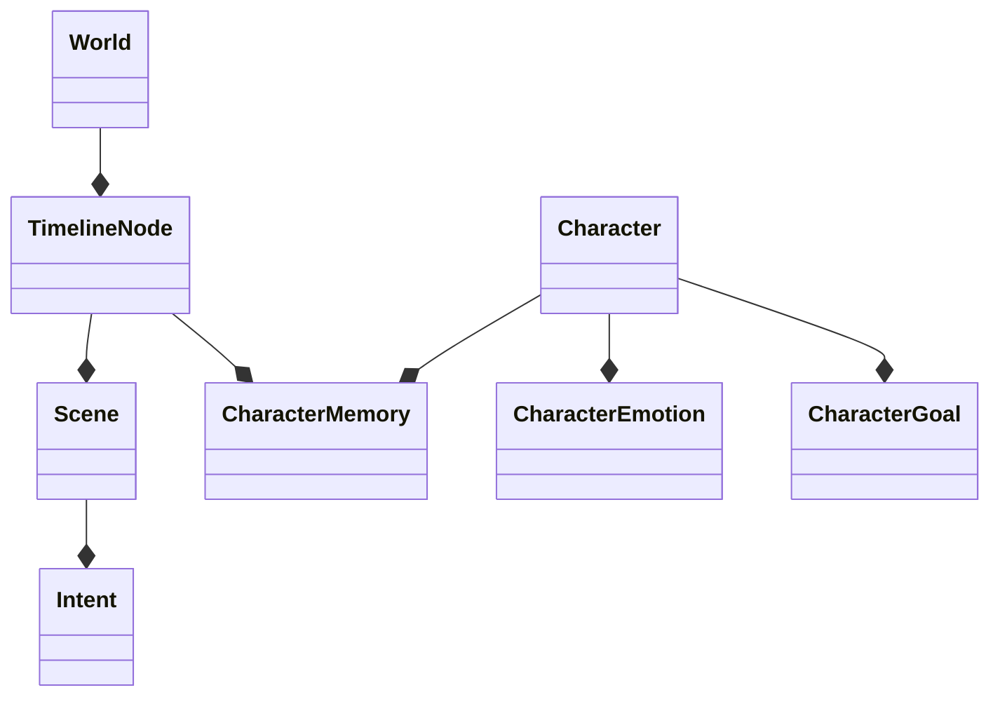

# Unified Myth World Engine: System Guide

Ref: `ADR-002`
Version: 1.1.0 (Timeline & Character Core)
Date: 2026-02-09

## 1. Core Philosophy

The Unified Myth World Engine integrates strictly defined physics (Immutability) with emergent narrative structures (Myths, Characters, Timelines).

1.  **Immutability**: History (`WorldEvent`, `WorldScar`) is append-only.
2.  **Causal Consistency**: Use a Directed Acyclic Graph (DAG) for time travel. No rewriting history; only forking.
3.  **Living Characters**: Characters are stateful aggregates (`Memory`, `Emotion`, `Goal`), not text prompts.

---

## 2. Architecture Layers

### Layer I: The Foundation (Physics)
*   **WorldClock**: Monotonic ticker.
*   **WorldEvent**: Immutable record.
*   **WorldScar**: Permanent consequences.

### Layer II: The Mythos (Belief & Emergence)
*   **WorldBelief**: Accumulated thought.
*   **WorldMyth**: Crystallized belief warping reality.

### Layer III: The Narrative (Interpretation)
*   **Observer**: Perspective filters.
*   **NarrativeService**: Projection engine.

### Layer IV: The Soul (Character Core)
*   **Character Aggregate**:
    *   `Memory`: Semantic (Facts) vs Episodic (Experiences). Validated by Timeline Ancestry.
    *   `Emotion`: Dynamic intensity (Decay/Amplify).
    *   `Goal`: Hierarchical motivations.
*   **Repository**: `CharacterEloquentRepository`.

### Layer V: The Brain (Dialogue Engine)
*   **Intent**: Structured action (`PROBE`, `REVEAL`).
*   **ConsistencyGuard**: Rule engine blocking out-of-character actions.
*   **TurnScheduler**: Prioritizes high-stakes agents.

### Layer VI: The Spine (Timeline DAG)
*   **TimelineNode**: A node in the multiverse graph.
*   **StateSnapshot**: Checkpoint of world state at a node.
*   **CausalConsistency**: Ensures agents only access memories from their own past (Ancestry Check).

---

## 3. Key Commands

### Managing the World
```bash
php artisan db:seed --class=WorldSeeder
php artisan world:analyze {world_id}
php artisan world:fork {world_id} {tick} "New Timeline"
```

---

## 4. Domain Models Map


