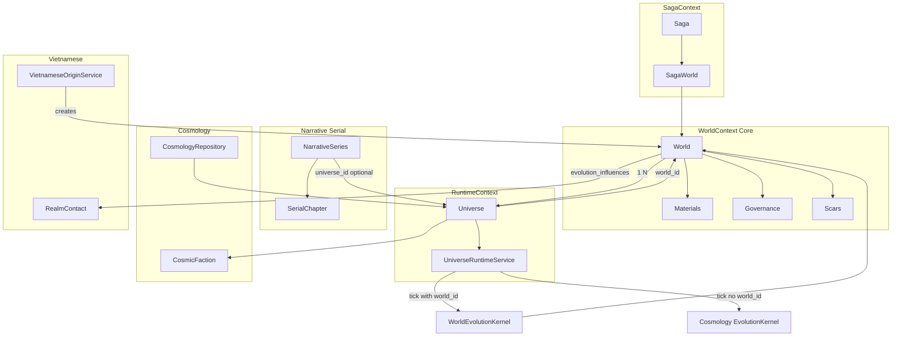

# Tổng hợp Backend WorldOS — Domains, quan hệ, công dụng

Tài liệu tổng hợp toàn bộ backend: các domain, model, bảng DB, mối quan hệ và công dụng từng phần. Bỏ qua frontend; tập trung thống nhất backend (World, Universe, Cosmology, Saga, Narrative, v.v.).

---

## 0. Tuzy — Nguồn sự thật domain (DDD)

**Vị trí:** `src/Tuzy/` (namespace `Tuzy\Domain\*`, `Tuzy\Application\*`, `Tuzy\Infrastructure\*`).

Logic nghiệp vụ (Value Objects, Domain Events, Entities, Application Handlers) được di chuyển dần vào **Tuzy**. `app/Domains/*` giữ tương thích ngược bằng **extends** hoặc **class_alias** trỏ tới Tuzy; các class App tương ứng đánh dấu `@deprecated`.

- **Value Objects / Events đã trong Tuzy:** EntropyScore, ShockEvent, Claim, PhysicsProfile, GeneVector, WorldLawUpdated, MaterialInjected, WorldDefined; WorldHealthStatus (enum); UniverseTicked, UniverseForked, UniverseCollapsed; ShockParams, CollapseProfile, SagaEvaluationReport, SagaEvaluationInput; BranchEvent; ChapterGenerated, StoryEvent, MemorySnapshot, PressureSignal, BeatSpec, DefaultOutcome, StoryOutcomeDTO; PhaseSignal, ConstraintProfile; SurvivalProbability, NarrativeWeight, RiskFactors, SurvivalTrend, SurvivalResult; ConflictSeed; IntelligenceSource, IntelligenceType, IntelligenceReport; MaterialState; Attractor (Cosmic); Axiom, CoreTruth (CoreTruth); HealthResult (WorldManagement); FactionMemory, IdeologyVector, PersonalityVector (Faction); GenrePromptCapsule (Genre); EpistemicIndex (Epistemology); EpistemicVector, OntologyVector, CivilizationVector, EnergyVector, WorldSeed (Cosmology); StorySlice, Intent, EmotionState, StateSnapshot (Narrative).  
- **Test domain Tuzy:** `tests/Unit/Tuzy/` — chạy `php vendor/bin/phpunit tests/Unit/Tuzy/`.  
- **Kế hoạch chi tiết:** `docs/plans/2026-02-20-domain-to-ddd-migration.md`.

---

## 1. Tổng quan kiến trúc

### 1.1 Ba bounded context (theo CONTEXT_MAP)

| Context | Vai trò | Nguồn chân lý |
|--------|---------|----------------|
| **WorldContext** (Core) | Evolution, materials, governance, collapse law, health | World = aggregate root |
| **RuntimeContext** | Instance, fork lineage, tick, chronicle | Universe = runtime instance của World |
| **SagaContext** | Narrative, branch scoring, canonize, publish | Đọc từ Runtime events (UniverseTicked, UniverseForked, UniverseCollapsed) |

Quan hệ: **WorldContext → RuntimeContext → SagaContext**. Universe thuộc World; Saga gắn World qua saga_worlds; Narrative/Serial có thể gắn Universe (narrative_series.universe_id).

### 1.2 Khái niệm cốt lõi

- **World**: Aggregate root. Định nghĩa “thế giới” (preset, origin_type, law_profile, config, evolution_influences). Một World có nhiều Universe (nhiều timeline/runtime instance).
- **Universe**: Runtime instance của World. State tại một thời điểm: state_vector (WorldStateVector), age, parameters. Thuộc World qua `world_id`. Tick/fork thao tác trên Universe.
- **Saga**: Chuỗi nhiều World chạy theo thứ tự (world_count, current_world_index). Mỗi “bước” saga là một World; SagaWorld nối saga_id ↔ world_id.
- **Cosmology**: Tập dịch vụ và entity cho “vũ trụ học”: Universe entity, BasePhysicsEngine (physics thuần; sau refactor), FieldSpace, tick, fork, faction, conflict, lifecycle. Persistence qua CosmologyRepository (UniverseModel). Universe luôn có world_id (NOT NULL).

---

## 2. Các domain và công dụng

### 2.1 World (Core)

- **Vị trí**: `app/Domains/World/`, `app/Models/World.php`
- **Công dụng**: Định danh thế giới; chứa luật, preset, config, evolution influences (vietnamese_hero, realm_contact). Materials, governance, scars, myths, health gắn World. World không “tick” trực tiếp trong Cosmology — tick áp dụng lên Universe; khi Universe có world_id thì evolution nên đi qua World (WorldEvolutionKernel).
- **Thành phần chính**: World (Eloquent), WorldEvolutionEngineAdapter, WorldForkService, WorldPowerProfileService, WorldTickService, ShockEventGenerator; Events: WorldDefined, WorldLawUpdated, MaterialInjected.
- **Quan hệ**: 1 World → nhiều Universe (universes.world_id). World có thể thuộc Saga qua saga_worlds. Nhiều bảng FK world_id: institutions, scars, world_myths, world_power_profiles, world_snapshots_v2, world_impulse_inbox, evolution_profiles, governance_logs, cosmic_snapshots, chronicles, v.v.

### 2.2 Runtime

- **Vị trí**: `app/Domains/Runtime/`
- **Công dụng**: Thực thi tick cho Universe; ủy quyền sang World khi Universe có world_id. Chính sách: World freeze → Universe không được tick (UniverseRuntimePolicy).
- **Thành phần chính**: UniverseRuntimeService (tick delegate to World evolution hoặc Cosmology kernel), Events: UniverseTicked, UniverseForked, UniverseCollapsed.
- **Quan hệ**: Đọc UniverseModel (world_id); gọi EvolutionEngineInterface (WorldEvolutionEngineAdapter) hoặc Cosmology::tick(). SagaContext subscribe UniverseTicked.

### 2.3 Cosmology

- **Vị trí**: `app/Domains/Cosmology/`
- **Công dụng**: “Vũ trụ học”: entity Universe (WorldStateVector, age, parameters), BasePhysicsEngine (physics thuần; collapse/reorganize ở World layer), FieldSpace (nhiều universe trong một “không gian”), tick internal/deprecated khi Universe không world_id. Repository persist UniverseModel; createCustom/findOrSeed require world_id. **WorldOS 2.0**: CosmologyRepository::**getRuntimeStateForWorld(world_id)** trả về age/entropy từ Universe đầu tiên của world — dùng khi runtime source of truth là Universe (RealmContactService, StateLoader, API current_era). Dịch vụ: BifurcationService, LifecycleService (spawn, death, collapse), FactionService, ConflictService, CouplingService, InterventionService, CrisisService, AnomalyService, GalacticWarfareService, AgentSpawnService, ArtifactService, GlobalDefenseService, HarbingerService; Evolution: ArcPhase, ArcDetector, PresetDescriptor, RegimeModifier; Mathematics: PressureAccumulationField, CriticalityDetector, InnovationBurst, StressModel.
- **Quan hệ**: UniverseModel có world_id (NOT NULL sau refactor), cosmic_faction_id. CosmologyRepository save/find/findOrSeed/createCustom/getRuntimeStateForWorld. Nhiều bảng gắn universe_id: epochs, turning_points, attractor_influence_snapshots, civilization_snapshots, civilization_diffs, civilization_cycles, player_faction, fleets, universe_attractors. Chronicles, cosmic_snapshots có **universe_id nullable** (WorldOS 2.0).
- **Style Layer (v3.04)**: Thêm `UniverseStyle` entity để lưu trữ toán học hóa "cảm giác" của thế giới (Style Vectors). `StyleAdvisorService` phân tích `UniverseSnapshot` mỗi 50 ticks để đề xuất cải thiện qua hệ thống Governance.

### 2.4 Evolution (một trục sau refactor)

- **BasePhysicsEngine** (`app/Domains/Cosmology/Services/BasePhysicsEngine.php`): Physics thuần (differentials, criticality, PhaseSignal). Không quyết định collapse; StructuralMutationEngine được gọi ở World layer. PresetDescriptor::fromWorld(World) đọc config.mutation_bias (từ BlueprintMutationPlanner sau collapse).
- **World Evolution** (`app/Domains/Evolution/`): **WorldEvolutionKernel** là kernel duy nhất: inject BasePhysicsEngine + StructuralMutationEngine; evolve World hoặc tickUniverse(World, Universe); dùng PresetDescriptor::fromWorld($world) để áp dụng mutation_bias. VectorDynamicsEngine path vẫn có cho World evolve; Saga tick **Universe** qua RuntimeService.

### 2.5 Saga

- **Vị trí**: `app/Domains/Saga/`, Models: Saga, SagaWorld, SagaObservation
- **Công dụng**: Chạy chuỗi nhiều World (saga_runSync). **Runtime-first (sau refactor)**: createWorld → UniverseFactory.spawnFromWorld($world) → lưu saga_worlds.universe_id; tick **Universe** qua UniverseRuntimeService.advance(); subscribe UniverseTicked/Collapsed/Forked; khi Collapsed: CivilizationScorer + BlueprintMutationPlanner → blueprint_plan trong collapse_context; createNextWorld merge blueprint_plan vào legacy, createWorld ghi config.mutation_bias lên World mới.
- **Thành phần chính**: SagaRunner, SagaDirector, MythLegacyExtractor, SagaObserver; Services: GenesisPresetService, LedgerNarrator, EntropyPressureService, NarrativeDictionary, ProseThesaurus, PhysicsMutator.
- **Quan hệ DB**: sagas (id, name, world_count, status, current_world_index, metadata); saga_worlds (saga_id, world_id, sequence, status, archetype_legacy, myth_legacy); saga_observations (saga_id, observation_type, observation).

### 2.6 Narrative / Serial

- **Vị trí**: `app/Domains/Narrative/`, Models: NarrativeSeries, SerialChapter, NarrativeState, NarrativeArcOutline, StoryBible, StoryBibleCharacter, ChapterTelemetry
- **Công dụng**: Truyện dài kỳ (serial): tạo series, sinh chương tiếp (generateNextChapter), Story Bible, arcs. **Advanced Narrative (v3.04)**: `DigestArcAction` tổng hợp Arc vào `StoryBible` (long-term memory); `BatchGenerateChaptersJob` sinh nhiều chương truyện song song; `SerialArcPlanner` hỗ trợ emergent arcs dựa trên Tension spikes.
- **Quan hệ**: NarrativeSeries.universe_id (nullable) → Universe. SerialChapter, NarrativeState, StoryBible, NarrativeArcOutline → narrative_series_id. Narrative không ghi World/Universe (theo NARRATIVE_MODULE_IO); ảnh hưởng Universe qua Mutation (narrative_affects_universe) hoặc qua pressure bridge (narrative_affects_via_pressure).

### 2.7 Mutation

- **Vị trí**: `app/Domains/Mutation/`
- **Công dụng**: Cửa duy nhất để “commit” kết quả cốt truyện vào Universe (UniverseMutationService). Arc completion (preview, confirm, auto-resolve) dùng service này; controller không gọi Universe::applyMutation trực tiếp. OutcomeQuantizer, MutationMapper, MutationLimiter, InertiaApplier.
- **Quan hệ**: Nhận universeId, StoryOutcomeDTO; đọc/ghi qua CosmologyRepository; dispatch UniverseMutationCommitted.

### 2.8 Vietnamese

- **Vị trí**: `app/Domains/Vietnamese/`
- **Công dụng**: Vietnamese = **một phần của vũ trụ** (một loại World/realm). VietnameseOriginService tạo World với origin_type = vietnamese (Trăm Trứng, Lạc Long Quân, Âu Cơ); RealmContactService (realm_name: China, France, Champa) tính influence theo era; VietnameseHeroInfluence / RealmContactInfluence (Evolution) đẩy lực vào VectorForce. AgentSpawnService (Cosmology) có thể summon agent từ VietnameseHero. Catalog read-only: VietnameseHero, HeroEvent (API vietnamese-heroes).
- **Quan hệ**: World.origin_type = 'vietnamese', World.config.evolution_influences = ['vietnamese_hero', 'realm_contact']. RealmContact (realm_name, start_era, end_era, influence_type). Chỉ có hiệu lực khi evolution chạy qua WorldEvolutionKernel (Saga tick World; tick Universe có world_id sau khi thống nhất cũng phải qua World kernel).

### 2.9 Conflict

- **Vị trí**: `app/Domains/Conflict/`
- **Công dụng**: StructuralInterpreter, ConflictSeed; tích hợp với Cosmology (ConflictService) cho xung đột giữa faction/universe.

### 2.10 Faction

- **Vị trí**: `app/Domains/Faction/`, Models: CosmicFaction (Cosmology), có thể có PlayerFaction (user_id, faction_id, universe_id)
- **Công dụng**: Faction trong cosmology (ideology, color, lineage); FactionService, ConflictResolver, DecisionEngine, FactionAgent. Universe.cosmic_faction_id; fleet, player_faction.

### 2.11 Material

- **Vị trí**: `app/Domains/Material/`, bảng materials, material_instances (world_id)
- **Công dụng**: Materials gắn World; MaterialSeeder, MaterialWorldBridge, MaterialArchetypeCoupler. Writer: activate, adjust strength, retire instance. Civilization Forge dùng preset/material.

### 2.12 Cosmic (Cosmic Snapshots / World Evolution Pipeline)

- **Vị trí**: `app/Domains/Cosmic/`
- **Công dụng**: CosmicSnapshotRepository, WorldSnapshot (CosmicState, EnvironmentState, CivilizationState), WorldEvolutionPipeline. SagaRunner dùng để load/save snapshot khi tick World (loadOrInitializeState).

### 2.13 Replay / Snapshot

- **Vị trí**: `app/Domains/Replay/`, WorldSnapshotV2, meta_layer_states
- **Công dụng**: SnapshotService; replay/rollback (World Hub).

### 2.14 Intelligence

- **Vị trí**: `app/Domains/Intelligence/`
- **Công dụng**: WorldIntelligenceService (aggregate thông tin world cho UI/API).

### 2.15 Genesis (Evolution domain)

- **Vị trí**: `app/Domains/Evolution/Services/GenesisService.php`, `app/Domains/Saga/Services/GenesisPresetService.php`
- **Công dụng**: GenesisService (incarnate world từ premise); GenesisPresetService (preset theo genre/power: cuu_trong_thien, vietnamese, v.v.). Writer Genesis API dùng preset để tạo Saga; SagaRunner createWorld dùng preset hoặc VietnameseOriginService.

### 2.16 StoryEngine (world-level simulation, legacy layer)

- **Vị trí**: `app/StoryEngine/` (không nằm trong `app/Domains/`).
- **Công dụng**: Engine mô phỏng cốt truyện ở mức **world**: mỗi “chapter” chạy một pipeline gồm Physics → SeedSelection → UnifiedRule (WorldLawValidator) → FactionAction → Economic → Balancing → Metrics. State: **WorldState**, **CharacterState**, **FactionState**; **Seed** / **InformationSeed** (xung đột, thông tin); **RuleApplier**, **SeedPicker**, **SeedTransition**. Dùng cho test (verify_operator_mode, verify_replay, verify_governance, verify_world_laws), AI services (AIIntegrationService, DynamicWorldEventGenerator, IntelligentNPC, AIStoryGenerator, PredictiveAnalytics) và AIManagementController khi cần state/simulation ở tầng world.
- **Thành phần chính**:
  - **Simulator**, **RefactoredSimulator**, **OptimizedSimulator**, **SimulationOrchestrator**, **PhaseExecutor**: chạy simulation theo chapter.
  - **SimulationPipeline** + **SimulationContext**; phases: PhysicsPhase, SeedSelectionPhase, UnifiedRulePhase, FactionActionPhase, EconomicPhase, BalancingPhase, MetricsPhase.
  - **Persistence**: EventStore, OptimizedEventStore (world_events), ReplayEngine (replay từ events).
  - **Commands**: CommandBus, ApplySeedCommand, SimulationCommand.
  - **Services**: StoryContentGenerator, NarrativeAssembler, StoryGenerationService (Seed, RuleApplier, SeedPicker); FakeStoryLLMService.
  - **Levers**: DeceptionResolver, PerceptionFilter, EconomicPressureResolver.
  - **Balancing**: WorldHealthCalculator, BalancingApplier.
  - **Character**: Character, CharacterGenerator, CharacterTraitDeriver, MaterialCharacterAffinity; **Material**: MaterialEventGenerator, MaterialNarrativeMapper.
- **Quan hệ với Domains**: **Saga** (Domains/Saga) là tầng cao hơn, điều phối Universe/tick — **không** nằm trong StoryEngine (xem SAGA_RUNNER.md). StoryEngine đọc World (world_id) cho kill switch / safe mode và có thể load Faction từ DB; ghi event vào world_events; OptimizedEventStore có thể đụng world_snapshots. Narrative/Serial (Domains/Narrative) là luồng serial + LLM riêng, không dùng StoryEngine pipeline.
- **Tóm tắt**: StoryEngine = simulation pipeline theo chapter (seeds, rules, factions, economy, balancing) tại một World; dùng cho AI/tests và một số controller; tách biệt với Saga (Universe runtime) và Narrative Serial (generate chapter).

---

## 3. Models và bảng DB chính — quan hệ

### 3.1 Nhân tố trung tâm

| Bảng | Model | Quan hệ chính |
|------|--------|----------------|
| worlds | World | 1 → N universes (world_id); N saga_worlds (saga_id, world_id); N institutions, scars, world_myths, world_power_profiles, material_instances, chronicles, cosmic_snapshots, world_snapshots_v2, world_impulse_inbox, evolution_profiles, governance_logs |
| universes | UniverseModel | N → 1 worlds (world_id); N → 1 cosmic_factions (cosmic_faction_id); N fleets; N epochs, turning_points, attractor_influence_snapshots, civilization_snapshots, civilization_diffs, civilization_cycles; player_faction.universe_id; narrative_series.universe_id (nullable); narrative_projections.universe_id |
| sagas | Saga | 1 → N saga_worlds (saga_id) |
| saga_worlds | SagaWorld | N → 1 sagas; N → 1 worlds (world_id) |
| cosmic_factions | CosmicFaction | 1 → N universes (cosmic_faction_id); parent_faction_id self-FK; player_faction.faction_id |

### 3.2 Narrative / Serial

| Bảng | Quan hệ |
|------|--------|
| narrative_series | universe_id (nullable) → universes.id |
| serial_chapters | narrative_series_id → narrative_series |
| narrative_state | narrative_series_id (unique) → narrative_series |
| narrative_arc_outlines | narrative_series_id → narrative_series |
| story_bibles | narrative_series_id (unique) → narrative_series |
| story_bible_characters | story_bible_id → story_bibles |
| chapter_telemetry | serial_chapter_id, narrative_series_id |

### 3.3 Cosmology / Evolution phụ

| Bảng | Quan hệ |
|------|--------|
| multiverse_meta | global meta |
| universe_attractors | universe_id → universes |
| attractor_centroid_history | attractor_id → universe_attractors |
| attractor_influence_snapshots | universe_id → universes |
| epochs | universe_id → universes |
| turning_points | universe_id → universes |
| civilization_snapshots, civilization_diffs, civilization_cycles | universe_id → universes |
| player_faction | user_id, faction_id → cosmic_factions, universe_id → universes |
| fleets | universe_id → universes |
| artifacts | (universe/collapse) |
| evolution_profiles | world_id nullable → worlds |
| governance_logs | world_id → worlds |

### 3.4 World-phụ thuộc

| Bảng | Quan hệ |
|------|--------|
| institutions, scars, world_myths, world_contradiction_memories | world_id → worlds |
| world_power_profiles | world_id → worlds |
| world_snapshots_v2, world_impulse_inbox | world_id → worlds |
| cosmic_snapshots, cosmic_events | world_id → worlds; **universe_id** (nullable, WorldOS 2.0) |
| chronicles | world_id → worlds; **universe_id** (nullable, WorldOS 2.0); SagaRunner ghi universe_id khi tick qua Universe |
| saga_entropy_ledgers | saga_id, world_id nullable |
| gate_channels | source_world_id, target_world_id → worlds |

### 3.5 Vietnamese

| Bảng | Ghi chú |
|------|--------|
| vietnamese_heroes | Catalog anh hùng (period, era, archetype, dimensions) |
| hero_events | hero_id → vietnamese_heroes |
| realm_contacts | realm_name, start_era, end_era, influence_type (China, France, Champa, v.v.) |

---

## 4. Luồng và điểm cần thống nhất

### 4.1 Luồng chuẩn đã chốt (Plan Phần 3)

- **Universe luôn thuộc World**: world_id NOT NULL; không standalone universe.
- **Universe chỉ tạo từ World**: Sau khi tạo World (Genesis/Saga hoặc Admin), trong cùng flow tạo ít nhất một Universe mặc định; hoặc chỉ tạo thêm qua Writer worlds/{id}/instances.
- **Tick Universe có world_id**: Bắt buộc qua World evolution (WorldEvolutionKernel + InfluenceAggregator), không dùng Cosmology EvolutionKernel cho case này.

### 4.2 Các mối quan hệ cần ràng buộc rõ

- **Saga ↔ World ↔ Universe**: Saga tạo World (createWorld); mỗi World sau khi tạo phải có ít nhất một Universe (SagaRunner hoặc service chung). SagaWorld chỉ nối saga ↔ world; không trực tiếp nối Saga ↔ Universe — Universe nối qua world_id.
- **Cosmology ↔ World**: Cosmology lưu Universe (UniverseModel); world_id phải có (sau migration). Tạo Universe chỉ khi có World; CosmologyController::store require world_id.
- **Narrative ↔ Universe/World**: NarrativeSeries có thể có universe_id (để đọc state làm context). Narrative không ghi World/Universe; mutation chỉ qua UniverseMutationService (arc completion). Nếu series gắn universe_id thì universe đó thuộc World → narrative gián tiếp gắn World qua Universe.

### 4.3 Hai kernel evolution — phân công rõ

| Kernel | Dùng khi | Công dụng |
|--------|----------|------------|
| Cosmology EvolutionKernel | Tick Universe **không** có world_id (sau khi bỏ standalone sẽ không còn) | Luật vật lý thuần (entropy, order, collapse, innovation burst) |
| WorldEvolutionKernel | Tick World (Saga); và **phải** dùng khi tick Universe có world_id | Luật vật lý + preset + influences (Vietnamese, realm_contact) |

Sau khi refactor: mọi Universe đều có world_id → mọi tick Universe đều qua WorldEvolutionKernel (và map state Universe ↔ World).

---

## 5. Sơ đồ quan hệ (high-level)

**Ba boundary tuyệt đối (WorldOS 2.0):** (1) UniverseRuntimeService không gọi BasePhysics trực tiếp. (2) Saga không tick World. (3) Narrative không ghi Universe trực tiếp. Chi tiết: [WORLDOS_2_FINAL_FORM_AND_LAB.md](WORLDOS_2_FINAL_FORM_AND_LAB.md).



---

## 6. API entry points (backend) — nhóm theo domain

- **Cosmology**: GET/POST /api/cosmology/universes, universe/{id}, tick, advance, chronicle, meta, faction, fleet, narrative/generate, arc preview/confirm/auto-resolve, defend, summon-agent, v.v.
- **Writer**: Genesis (presets, store), sagas (list, tree, run), worlds (index, show, instances), world hub (freeze, resume, step, rollback, inject, scar, emergency), god-console, materials; universe inject/canonize/bifurcate/induce-collapse.
- **Serial**: series CRUD, genres, generate-next-chapter, outline, arcs, story-bible, characters.
- **Admin**: stats, universes, lock, audit-logs, alerts; worlds CRUD.
- **Marketplace**: artifacts, infuse.
- **Vietnamese Heroes**: list, search, statistics, dimension-distribution, era profile, detail, events (read-only).
- **Civilization Forge**: anchors, generate, narrative/generate.
- **Auth**: GET /api/user, POST /api/login, POST /api/logout (session).

---

## 7. Tài liệu tham chiếu

- DOMAIN_ARCHITECTURE.md — World root, Universe runtime
- CONTEXT_MAP.md — WorldContext, RuntimeContext, SagaContext
- DOMAIN_WORLD_UNIVERSE.md — World vs Universe, parameters, Genesis vs Khai Thiên
- ACCESS_ZONES.md — Public/Protected API
- NARRATIVE_MODULE_IO.md — Serial input/output, không ghi World/Universe
- CAUSALITY_BRIDGE.md — Narrative → narrative_driven_state; path pressure (narrative_affects_via_pressure)
- PHASE_TRANSITION_ENGINE.md — EvolutionKernel (pressure, criticality, collapse)
- **WORLDOS_2_CLEAN_ARCHITECTURE.md** — North star kiến trúc Clean: 4 tầng, InfluencePipeline, Narrative pressure (PressureSignal), mutation boundary
- **WORLDOS_2_WORLD_RUNTIME_AUDIT.md** — Audit runtime trên World; policy đọc/ghi current_time/entropy; snapshot/chronicle universe_id
- **WORLDOS_2_FINAL_FORM_AND_LAB.md** — Final form: 3 boundary tuyệt đối, StoryEngine placement, snapshot taxonomy, Saga meta (Pareto, AI Historian mode A), continuous engine + AI toggle, Docker + VPS deployment
- BACKEND_REFACTOR_PLAN_MODULAR.md — Plan refactor Phase 1–5, link WORLDOS_2_CLEAN
- Plan (frontend_cho_backend_worldos) — Phần 3: luồng chuẩn World/Universe, bảng xử lý song song/ngoài luồng

---

## 8. Jobs và queue

| Job | Công dụng |
|-----|-----------|
| RunSagaSimulationJob | Chạy saga (SagaRunner::runSync); tạo World, tick, chronicle, legacy. |
| TickUniverseJob | Tick một universe (UniverseRuntimeService). |
| EvolveWorldJob | Tick world (evolution kernel). |
| GenerateSerialChapterJob | SerialStoryService::generateNextChapter. |
| NarrativeGenerateJob | Sinh narrative từ cosmology/universe. |

---

## 9. Config liên quan

- **config/cors.php**: allowed_origins (localhost:3000), supports_credentials (SPA).
- **config/cosmology.php**: (nếu có) cấu hình cosmology.
- **config/llm.php**: LLM cho narrative/serial.
- **config/mutation.php**: Mutation domain.
- **config/services.php**: Các service binding.
- **bootstrap/app.php**: routes api → api_vietnamese.php (prefix /api); CSRF exclude api/user, api/login, api/logout.

---

## 10. Overview: Cosmology EvolutionKernel (physics-based) vs WorldEvolutionKernel (preset + influence-based)

### 10.1 Cosmology EvolutionKernel — physics-based

- **Vị trí**: `app/Domains/Cosmology/Services/EvolutionKernel.php`
- **Input**: Chỉ **WorldStateVector** (state hiện tại). Tùy chọn: PresetDescriptor (hệ số đọc từ preset), RegimeModifier (nhân thêm theo regime).
- **Output**: WorldStateVector mới (sau một bước evolve).
- **Không** nhận World hay EvolutionContext; **không** có InfluenceRegistry (Vietnamese, realm_contact).

**Cơ chế:**

1. **calculateDifferentials**: Tính đạo hàm từng chiều (entropy, order, inequality, trauma, elite_cohesion, resource_stock, military, cohesion, legitimacy, innovation) theo “luật vật lý” cố định (hệ số hardcode hoặc lấy từ PresetDescriptor/RegimeModifier):
   - Entropy: tăng bởi inequality², trauma, (1 - innovation), giảm bởi cohesion.
   - Order: tăng bởi cohesion, military, giảm bởi entropy.
   - Inequality: accumulation + elite_graft (elite_cohesion × (1 - legitimacy)) - redistribution × legitimacy.
   - Trauma: war (military > 0.6), chaos (entropy > 0.7), trừ healing × cohesion.
   - Innovation: InnovationBurst->deltaInnovation (base delta + burst khi entropy cao).
   - Các chiều còn lại: resource, military, cohesion, legitimacy theo công thức tuyến tính từ state.

2. **applyFeedbackLoops**: Sau khi state = state + differentials:
   - **CriticalityDetector::assess**: contradiction_index (từ PressureAccumulationField), so với ngưỡng → should_collapse, can_reorganize, phase (STABLE / REORGANIZATION_POSSIBLE / CRITICAL / COLLAPSE_IMMINENT).
   - Nếu **should_collapse** → StructuralMutationEngine->mutate (structural fracture: order/legitimacy/cohesion giảm mạnh, trauma tăng).
   - Nếu **can_reorganize** → InnovationBurst->reorganizationBoost (tăng innovation để hệ tự chữa).
   - Nếu entropy > criticalEntropyThreshold → giảm order, legitimacy, tăng inequality.
   - Nếu resource_stock < 0.1 → giảm military, innovation, tăng trauma.
   - Nếu inequality cao và legitimacy thấp → giảm order, tăng entropy, trauma.

3. **clampState**: Clamp mọi chiều về [0, 1].

**Phụ thuộc**: PressureAccumulationField (contradiction index), CriticalityDetector (phase, collapse/reorganize), InnovationBurst (delta innovation, reorganization boost), StructuralMutationEngine (mutate khi collapse).

**Công dụng**: Mô phỏng thuần “vật lý” state vector: không biết World, không có anh hùng/realm; phù hợp **Universe standalone** (sau khi thống nhất sẽ không còn) hoặc làm tầng dưới nếu sau này gộp với preset/influence.

---

### 10.2 WorldEvolutionKernel — preset + influence-based

- **Vị trí**: `app/Domains/Evolution/Kernel/WorldEvolutionKernel.php`
- **Input**: **World** (Eloquent), **số năm** (years). State được load từ World qua StateLoader (vector), không nhận Universe trực tiếp — gọi từ SagaRunner (tick World) hoặc sẽ dùng khi tick Universe có world_id (cần map state Universe ↔ World).
- **Output**: Cập nhật World (current_time, entropy) và persist state qua StateLoader; trả về **BranchEvent** nếu BifurcationAnalyzer phát hiện nhánh.

**Luồng một bước (qua VectorDynamicsEngine):**

1. **StateLoader::loadVector(world)** → WorldStateVector (từ snapshot/DB gắn World).
2. Với mỗi year: **EvolutionContext::fromWorld(world, year)** (worldId, year, presetKey, config).
3. **VectorDynamicsEngine::step(state, context, prevState)**:
   - **DriftField::compute(state)**: Lực nội tại thuần (không context): inequality → cohesion giảm, innovation → legitimacy dao động, trauma → elite_cohesion giảm; order vs entropy; entropy drift; innovation, military, resource, inequality, trauma theo công thức đơn giản. Trả về **VectorForce** (intrinsic).
   - **InfluenceAggregator::aggregate(state, context)**: Load World từ context.worldId; InfluenceRegistry::resolveForWorld(world) → danh sách EvolutionInfluence (theo config evolution_influences: vietnamese_hero, realm_contact). Mỗi influence: isActive(state, context) → force(state, context) → VectorForce; có thể qua SensitivityMatrix; cộng tổng → **VectorForce** (influence).
   - **netForce = intrinsic + influence**.
   - **integrate(state, netForce)**: next[i] = clamp(state[i] + tanh(netForce[i] * DT), 0, 1); có cross-term (entropy dampen bởi order×cohesion).
   - **BifurcationAnalyzer::analyze(next, prev, netForce, context)** → BranchEvent nếu có (curvature/divergence).
4. World.current_time += years; World.entropy = state.getEntropy(); StateLoader::saveVector(world, state).

**Influences điển hình:**

- **VietnameseHeroInfluence**: EvolutionContext.year → era; CosmicIntegrationService::calculateEraCivilizationBoost(era) → governance, culture, philosophy, military, education, spirituality; map vào cohesion, legitimacy, innovation, military, entropy (scale 0.02). Chỉ active khi World có evolution_influences chứa 'vietnamese_hero'.
- **RealmContactInfluence**: RealmContactService::calculateRealmInfluenceForEra(era) → military_pressure, cultural_assimilation, trade_bonus, instability; map vào military, entropy, cohesion, resource_stock, legitimacy (scale 0.015).

**Công dụng**: Evolution **gắn World**: preset (presetKey trong context) và influences (Vietnamese, realm contact) thay đổi lực đẩy theo era và config World. Dùng khi tick **World** (Saga) và **phải** dùng khi tick **Universe có world_id** (sau khi refactor) để “Vietnamese là một phần vũ trụ” và realm contact có hiệu lực.

---

### 10.3 So sánh nhanh

| Tiêu chí | Cosmology EvolutionKernel | WorldEvolutionKernel |
|----------|---------------------------|----------------------|
| Input | WorldStateVector (+ PresetDescriptor, RegimeModifier tùy chọn) | World + years (state load từ World) |
| Context | Không có World/era | EvolutionContext (worldId, year, presetKey, config) |
| Preset | Hệ số từ PresetDescriptor (nếu truyền) | presetKey từ World; có thể ảnh hưởng qua StateLoader/SensitivityMatrix |
| Influences | Không | Có (InfluenceAggregator: VietnameseHero, RealmContact, …) |
| Collapse / phase | CriticalityDetector + StructuralMutationEngine + InnovationBurst | Không trực tiếp (DriftField + integrate; BifurcationAnalyzer chỉ trả branch event) |
| Integration | state + differentials → feedback loops → clamp | netForce = drift + influence; next = state + tanh(force*DT); clamp |
| Nơi gọi | Universe::evolve(kernel); Cosmology::tick(); WorldEvolutionEngineAdapter (hiện tại — cần đổi) | SagaRunner (tick World); sau refactor: tick Universe có world_id |

---

## 11. Hướng tái cấu trúc Evolution (kiến trúc đúng)

Phần này ghi nhận phân tích kiến trúc và đề xuất refactor: **một trục tiến hóa duy nhất**, **World = source of law**, **Universe = instance**, **Saga điều phối instance**, **không tick đi vòng qua Cosmology kernel trực tiếp**.

### 11.1 Vấn đề cốt lõi hiện tại

- **Hai trục tiến hóa song song**: Cosmology EvolutionKernel (physics-based) và WorldEvolutionKernel (preset + influence-based). Trong khi đã chốt: Universe luôn thuộc World → mọi tick phải đi qua World kernel.
- **Thực tế code**: `UniverseRuntimeService` → `WorldEvolutionEngineAdapter` → **Cosmology EvolutionKernel**. Tức là vi phạm ràng buộc domain: tick Universe đang không qua World kernel.
- **Hậu quả**: Cosmology kernel không nhận World; không biết origin_type, evolution_influences, realm_contact, vietnamese_hero → Universe tick “mất linh hồn world”. Đây là **lỗi kiến trúc**, không phải bug.
- **Trùng logic**: Cả hai kernel đều có drift, feedback, mutation, clamp. Nếu giữ cả hai, logic sẽ diverge; collapse không đồng nhất; narrative khó dự đoán.

### 11.2 Thiết kế đúng: một kernel duy nhất

**Cosmology EvolutionKernel** không còn là kernel. Nó bị **hạ xuống thành BasePhysicsEngine**:

- **Vai trò**: Chỉ làm một bước vật lý thuần: `PhysicsStep(WorldStateVector $v, PhysicsProfile $profile) → WorldStateVector`.
- **Giữ**: calculateDifferentials, applyFeedbackLoops, clampState.
- **Bỏ khỏi tầng physics**: StructuralMutationEngine không sống trong physics; collapse/reorganize không quyết định ở đây.

**WorldEvolutionKernel** là **kernel thực sự duy nhất**, thành phần:

- **BasePhysicsEngine** (physics step thuần)
- **InfluenceAggregator** (world preset + era + vietnamese_hero, realm_contact)
- **RegimeModifier**
- **PhaseTransitionEngine** (CriticalityDetector trả PhaseSignal: shouldCollapse, canReorganize, severity)
- **BifurcationAnalyzer**

**Luồng đúng mỗi year:**

1. Load state (từ Universe hoặc World qua StateLoader).
2. `v = basePhysics->step(v)`.
3. `v = influenceAggregator->apply(world, v, year)`.
4. `v = regimeModifier->apply(world, v)`.
5. `phase = phaseEngine->analyze(v)`.
6. Nếu phase->shouldCollapse → mutationEngine->mutate(v) (tầng structural / lịch sử, không nằm trong physics).
7. Nếu phase->canReorganize → innovationEngine->boost(v).
8. Save state.

**Collapse ở World layer**: Collapse là sự kiện lịch sử (myth, scars, governance, saga entropy ledger), không chỉ vật lý. CriticalityDetector trả **PhaseSignal**; WorldEvolutionKernel quyết định hành động (mutate, boost, branch).

### 11.3 Saga phải tạo Universe

- **Hiện tại**: SagaRunner → createWorld → tick **World**. Universe là runtime instance nhưng Saga không tạo Universe → Saga đang bypass RuntimeContext.
- **Thiết kế đúng**: Khi Saga createWorld → ngay sau đó `$universe = universeFactory->spawnFromWorld($world)`; attach saga/world (và có thể saga_universes: saga_id, universe_id, sequence); **tick Universe**, không tick World trực tiếp. World chỉ là blueprint; Universe mới là thứ được tiến hóa.

### 11.4 UniverseRuntimeService sau refactor

- **Không còn**: `Cosmology::tick()` khi Universe có world_id.
- **Đúng**: `if ($universe->world_id) { $world = $worldRepo->find($universe->world_id); $this->worldEvolutionKernel->tickUniverse($world, $universe); }` — một trục duy nhất qua World kernel.

### 11.5 Khác biệt bản chất hai tầng

| Thành phần | Cosmology (physics) | World (kernel) |
|------------|---------------------|----------------|
| Drift | Vật lý | Vật lý (gọi BasePhysics) |
| Influence | Không | Có (era, preset) |
| Era | Không | Có |
| Collapse | Vật lý (nếu giữ cũ) | Lịch sử (PhaseSignal + mutation ở World layer) |
| Mutation | Structural | Lịch sử + saga |
| Bifurcation | Implicit | Explicit BranchEvent |

→ Kernel đúng phải là **WorldEvolutionKernel**; physics chỉ là nền tảng bên trong.

### 11.6 Refactor an toàn (gợi ý từng bước)

1. **Rename**: `Cosmology\Services\EvolutionKernel` → `BasePhysicsEngine` (hoặc đặt trong Evolution domain).
2. **Tách**: StructuralMutationEngine ra khỏi physics; CriticalityDetector trả PhaseSignal; quyết định collapse/reorganize trong WorldEvolutionKernel.
3. **Inject**: BasePhysicsEngine vào WorldEvolutionKernel; kernel gọi basePhysics->step(v) rồi influence + regime + phase + mutation/boost.
4. **UniverseRuntimeService**: Chỉ gọi `worldEvolutionKernel->tickUniverse($world, $universe)` khi có world_id; không gọi Cosmology kernel.
5. **Saga**: Sau createWorld gọi universeFactory->spawnFromWorld($world); tick Universe; có thể thêm saga_universes (saga_id, universe_id, sequence) nếu cần.

### 11.7 Narrative-first (B)

- **A)** Physics sandbox có storytelling → giữ Cosmology kernel trung tâm.
- **B)** Narrative-first system có physics support → **World kernel phải là lõi tuyệt đối**.

Với hướng đang xây (Saga, Vietnamese, legacy, myth) → rõ ràng là **B**. Một trục tiến hóa duy nhất qua WorldEvolutionKernel là nhất quán với lựa chọn đó.

### 11.8 Nguyên tắc tóm tắt

- **World** = source of law.
- **Universe** = instance của law.
- **Saga** = điều phối instance (tạo Universe từ World, tick Universe).
- **Narrative** = quan sát instance (đọc, không ghi).
- **Mutation** = commit vào instance (qua MutationService, giữ ranh giới).

---

## 12. Saga: định nghĩa đúng và hướng refactor

Refactor theo hướng này **có thể** và nhất quán với Section 11. Saga không phải World, không phải Universe, không phải Narrative — Saga là **bộ điều phối tiến hóa nhiều World/Universe theo một ý đồ meta**.

### 12.1 Định nghĩa chính xác

- **World** = luật (blueprint).
- **Universe** = timeline (runtime instance thực thi luật).
- **Saga** = chuỗi timeline có ý nghĩa: meta-process điều khiển chuỗi các Universe sinh ra từ các World blueprint khác nhau, theo mục tiêu lịch sử/triết học/narrative cao hơn.

**Bản chất**: Universe tiến hóa trong World; World tiến hóa qua Saga. Saga = evolutionary selection layer (Darwin engine của các World).

### 12.2 Saga đúng: Runtime-first, không tick World

- **Hiện tại (sai)**: SagaRunner → createWorld → **tick World** → extract legacy → next World. Saga bypass RuntimeContext.
- **Đúng**: Saga chỉ điều phối **Universe**. Năm việc: (1) Genesis: create World, spawn Universe từ World; (2) Evolution: runtimeService->tick($universe, years); (3) Observation: subscribe UniverseTicked, UniverseCollapsed, UniverseForked; (4) Legacy extraction khi collapse; (5) World mutation cho iteration tiếp: new World từ legacy (WorldForkService / BlueprintMutationPlanner).

### 12.3 Kiến trúc Saga (final form)

- **Saga** → SagaWorld (world blueprint sequence), **SagaUniverse** (runtime instances: saga_id, universe_id, sequence), SagaEntropyLedger, SagaObserver, **SagaSelectionStrategy**.
- Flow: World (blueprint) → spawn Universe → tick → Events → SagaObserver → Legacy extraction → SelectionStrategy → New World blueprint.

### 12.4 AI Meta-Evaluator và Multi-Objective

- **SagaMetaEvaluator**: Đánh giá outcome (CollapseProfile, CivilizationScore, MythSignature), không gửi raw vector; hai tầng: deterministic heuristic + AI pattern reasoning; **BlueprintMutationPlanner** với clamp và anti-oscillation (AI không toàn quyền).
- **Multi-objective Pareto** (E) + **Stability hard constraint** (D): CivilizationObjectiveVector (survivalYears, innovationPeak, mythDepth, resilience, entropyControl, …); StabilityConstraint vi phạm → không vào Pareto front; ParetoFrontManager lưu generation history.
- **Converge về civilization optimum** (A): ConvergenceController, centroid vùng tốt nhất, mutation hướng gradient về centroid; exploration decay tránh local optimum.
- **Long-lived equilibrium >1000 năm** (C): Equilibrium basin (không một điểm); oscillation_amplitude, adaptation_rate; survival threshold gating; mutation ±0.1.
- **Dual stability** (C): internal_stability_index + external_resilience_index; **ShockSimulationLayer** (ShockInjector) khi chạy Saga mode để đo external survival; target region kép.

### 12.5 Refactor có thể làm từng bước

1. Saga không tick World; spawn Universe sau createWorld; tick Universe.
2. Thêm SagaUniverse (saga_id, universe_id, sequence) nếu cần.
3. SagaObserver subscribe runtime events; legacy extraction khi UniverseCollapsed.
4. Đưa SelectionStrategy / ParetoFrontManager / StabilityConstraint / ConvergenceController vào sau khi flow Runtime-first ổn định.
5. AI Meta-Evaluator (CivilizationScorer rule-based trước, rồi SagaMetaEvaluator + BlueprintMutationPlanner) và ShockInjector có thể thêm theo phase.

Chi tiết đầy đủ (DTO, class layout, prompt gợi ý, mutation rules, exploration schedule): xem **[BACKEND_SAGA_ARCHITECTURE.md](BACKEND_SAGA_ARCHITECTURE.md)**.

---

## 13. Truyện ảnh hưởng tiến hóa (Causality Bridge) — overview và chỉnh sửa phù hợp flow

Chức năng “truyện ảnh hưởng đến tiến hóa” hiện được implement qua **Causality Bridge** (Narrative → state). Cần phân biệt hai tầng: (1) ảnh hưởng **narrative state** (prompt chương sau) và (2) ảnh hưởng **Universe state** (tiến hóa sử thi của universe). Chỉ (1) đang có; (2) chưa có và phải đi qua Mutation nếu muốn.

### 13.1 Hiện trạng (đã implement)

**Luồng hiện tại:**

1. Sau khi LLM trả chapter, `SerialStoryService::generateNextChapter()` gọi `projectNarrativeEventsToWorld(seriesId, content)`.
2. **StoryEventExtractor** (rule-based): trích sự kiện có cấu trúc từ nội dung chương → `StoryEvent[]` (type, severity). Ví dụ: "dark magic", "corruption" → magic_corruption; "invasion", "killed" → invasion / violence.
3. **WorldMutationPolicy**: Ánh xạ loại sự kiện → **delta** trên **narrative_driven_state** (shadow_presence, magic_stability, threat_level). State clamp 0–1.
4. **Lưu**: Chỉ ghi vào **narrative_state.narrative_driven_state** (theo narrative_series_id). **Không ghi** vào World, Universe, state_vector.
5. **Prompt chương sau**: Build chronicleContext có `current_world_state_narrative` = chuỗi serialize từ narrative_driven_state (StateSerializerForPrompt) → LLM thấy “thế giới truyện” đã thay đổi theo chương trước.

**File chính:** `Narrative/Bridge/DTO/StoryEvent.php`, `Contracts/StoryEventExtractorInterface.php`, `Extractor/RuleBasedStoryEventExtractor.php`, `WorldMutationPolicy.php`, `StateSerializerForPrompt.php`; gọi trong `SerialStoryService::projectNarrativeEventsToWorld()` và khi build chronicleContext.

**Kết luận hiện trạng:** Truyện ảnh hưởng **tiến hóa narrative** (narrative_driven_state → prompt chương sau). **Không** ảnh hưởng **tiến hóa Universe** (state_vector, entropy, order, cohesion, …). NARRATIVE_MODULE_IO ghi rõ: “Không ghi vào World, Universe; muốn truyện ảnh hưởng World cần thêm adapter riêng.”

### 13.2 Khoảng trống so với “tiến hóa sử thi của universe”

Nếu “tiến hóa sử thi của universe” = **Universe state_vector** (và tick tiếp theo) thay đổi theo diễn biến truyện:

- Hiện tại **không có** đường truyện → state_vector. Narrative chỉ đọc Universe (khi series có universe_id) để lấy world_state vào context; không commit thay đổi.
- Ràng buộc kiến trúc: **Mutation** là cửa duy nhất commit vào Universe (UniverseMutationService). Narrative không được ghi trực tiếp vào World/Universe.

### 13.3 Chỉnh sửa phù hợp flow hiện tại

**Giữ nguyên (không sửa):**

- Causality Bridge hiện tại: extract events → narrative_driven_state → prompt. Đây là “truyện ảnh hưởng narrative” và đúng với DDD (Narrative không ghi World/Universe).

**Nếu muốn thêm “truyện ảnh hưởng tiến hóa Universe”:**

1. **Một cửa duy nhất**: Mọi thay đổi state Universe phải đi qua **UniverseMutationService** (hoặc contract tương đương). Narrative không gọi CosmologyRepository.save hay Universe::applyMutation trực tiếp.
2. **Adapter Narrative → Mutation**: Thêm lớp (ví dụ **NarrativeToUniverseBridge** hoặc dùng sẵn event + listener):
   - Input: series_id, chapter content (hoặc đã extract `StoryEvent[]`).
   - Logic: Map story events → delta hợp lệ lên state (ví dụ delta nhỏ lên entropy, order, cohesion, threat tương ứng) hoặc map sang **StoryOutcomeDTO**-like (result + intensity) nếu Mutation đã có template tương ứng.
   - Output: Gọi **UniverseMutationService::commit(universeId, outcome hoặc delta, …)** với universeId lấy từ **NarrativeSeries.universe_id** (chỉ khi series gắn universe).
3. **Điều kiện**: Chỉ khi `series.universe_id` không null và Universe tồn tại. Magnitude nên giới hạn (ví dụ shadow multiplier 0.2–0.3) để truyện không “đè” physics.
4. **Vị trí gọi**: Sau khi đã cập nhật narrative_driven_state (projectNarrativeEventsToWorld), nếu config bật “narrative_affects_universe”: gọi adapter → commit. Có thể async (job) để không block generateNextChapter.

**Sơ đồ luồng đề xuất (khi bật ảnh hưởng Universe):**

```
Chapter content
  → StoryEventExtractor → StoryEvent[]
  → WorldMutationPolicy → narrative_driven_state (lưu narrative_state)  [giữ nguyên]
  → (optional) NarrativeToUniverseAdapter: StoryEvent[] → delta/StoryOutcomeDTO
  → UniverseMutationService.commit(universeId, …)   [một cửa]
  → Universe state_vector thay đổi → tick tiếp theo mang theo “dấu truyện”
```

### 13.4 Hai đường ảnh hưởng Universe (đã có)

| Cách | Config | Cơ chế |
|------|--------|--------|
| **Mutate vector** | `mutation.narrative_affects_universe` | NarrativeToUniverseAdapter: StoryEvent[] → StoryOutcomeDTO → UniverseMutationService.commit (magnitude giới hạn). |
| **Pressure signal (Clean)** | `mutation.narrative_affects_via_pressure` | Adapter gọi **NarrativePressureBridgeInterface::injectPressure(PressureSignal)**; không gọi MutationService. Narrative tạo điều kiện phase transition (pressure/contradiction), không chỉnh vector trực tiếp. Stub: NullNarrativePressureBridge; DTO PressureSignal (universe_id, intensity, source). Xem WORLDOS_2_CLEAN_ARCHITECTURE.md § VI. |

### 13.5 Tóm tắt

| Khía cạnh | Hiện trạng | Ghi chú |
|-----------|------------|--------|
| Narrative → narrative_driven_state | Có; lưu narrative_state; đưa vào prompt | Giữ nguyên |
| Narrative → Universe (mutate) | Có khi bật narrative_affects_universe | Adapter → UniverseMutationService; magnitude giới hạn |
| Narrative → Universe (pressure) | Contract + stub khi bật narrative_affects_via_pressure | PressureSignal → NarrativePressureBridge; PhaseEngine đọc pressure (chưa implement bridge thật) |
| Ràng buộc domain | Narrative không ghi World/Universe trực tiếp | Giữ; mutate qua Mutation; pressure qua bridge |

Như vậy “truyện ảnh hưởng tiến hóa” gồm: **tiến hóa narrative** (prompt), **tiến hóa Universe qua mutate** (adapter + MutationService), và **tiến hóa Universe qua pressure** (contract đã có, bridge thật tùy phase sau).

---

## 14. Trạng thái sau refactor (Phase 1–4) và WorldOS 2.0 Clean

Refactor theo [BACKEND_REFACTOR_PLAN_MODULAR.md](BACKEND_REFACTOR_PLAN_MODULAR.md) đã triển khai xong Phase 1–4. **WorldOS 2.0 Clean** (xem [WORLDOS_2_CLEAN_ARCHITECTURE.md](WORLDOS_2_CLEAN_ARCHITECTURE.md), [WORLDOS_2_WORLD_RUNTIME_AUDIT.md](WORLDOS_2_WORLD_RUNTIME_AUDIT.md)) bổ sung:

- **Một trục tiến hóa**: Cosmology EvolutionKernel đã đổi tên thành **BasePhysicsEngine**; **WorldEvolutionKernel** là kernel duy nhất (inject BasePhysicsEngine + StructuralMutationEngine). Tick Universe luôn qua `evolutionEngine->applyTick($universe)` → WorldEvolutionEngineAdapter → WorldEvolutionKernel.tickUniverse(World, Universe). PresetDescriptor::fromWorld(World) đọc `config.mutation_bias` (từ BlueprintMutationPlanner sau collapse) và áp dụng lên physics params.
- **Universe.world_id NOT NULL**: Migration gán universe không world vào World "Legacy"; CosmologyRepository createCustom/findOrSeed bắt buộc world_id; API Cosmology trả 404 khi universe không tồn tại.
- **Saga runtime-first**: createWorld → UniverseFactory.spawnFromWorld($world) → saga_worlds.universe_id; simulateWorld gọi advance($universeId, $ticks, $sagaId, $startYear); UniverseRuntimeEventSubscriber lắng nghe UniverseCollapsed → CivilizationScorer + BlueprintMutationPlanner (với ConvergenceController: centroid, exploration decay) và lưu blueprint_plan + objective_vector vào collapse_context; createNextWorld merge legacy; createWorld ghi mutation_bias vào world.config. **Phase 4.2 đầy đủ**: ShockInjector (config/saga.php) inject shock theo chu kỳ khi tick Saga; WorldEvolutionKernel applyShockPerturbation theo type (military/resource/ideology/tech).
- **Narrative → Universe**: Config `mutation.narrative_affects_universe` → NarrativeToUniverseAdapter gọi UniverseMutationService.commit; config `mutation.narrative_affects_via_pressure` → adapter gọi NarrativePressureBridgeInterface.injectPressure(PressureSignal), stub NullNarrativePressureBridge.
- **Runtime đọc từ Universe (WorldOS 2.0)**: CosmologyRepository::**getRuntimeStateForWorld(world_id)** trả về age/entropy từ Universe. Đã dùng tại: RealmContactService, StateLoader (currentYearForWorld), WriterCosmologyController (getSagaTree), WorldHubController (loadHeroesData), SagaExplorerController (tree). Policy: chỉ SagaRunner ghi current_time/entropy lên World (sync từ Universe sau advance).
- **Snapshot/Chronicle universe_id**: Bảng chronicles và cosmic_snapshots có cột **universe_id** (nullable). SagaRunner khi ghi chronicle truyền universe_id khi tick đi qua Universe; tạo mới từ Universe path nên gắn universe_id khi có.
- **Module boundary**: Runtime inject EvolutionEngineInterface; Narrative/Mutation không depend Vietnamese; SerialStoryService resolve genre qua CosmologyRepository.getWorldIdForUniverse + World.

Chi tiết từng bước: xem BACKEND_REFACTOR_PLAN_MODULAR.md. Section 11–13 trong tài liệu này mô tả thiết kế đúng và đã được triển khai theo hướng đó.

---

*Tài liệu này tổng hợp toàn bộ backend để thống nhất World, Universe, Cosmology, Saga, Narrative và các domain liên quan; bỏ qua phần frontend.*
