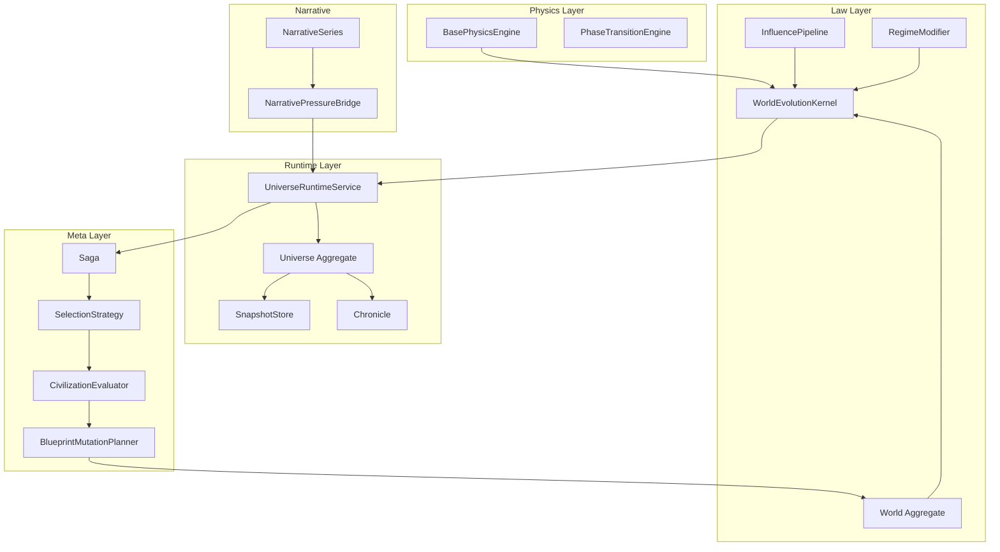

# WorldOS 2.0 — Clean Form Architecture

Kiến trúc mục tiêu: production-grade, ranh giới rõ, không vỡ DDD. Tài liệu này là **north star** cho refactor và đóng băng feature.

---

## I. Nguyên tắc nền tảng (Invariants)

| Nguyên tắc | Mô tả |
|------------|--------|
| **World = Source of Law** | World chỉ chứa luật, preset, config, influences. Không chứa runtime state. |
| **Universe = Runtime Instance** | Mọi state tại thời điểm t (vector, age, snapshot, chronicle) sống ở Universe. |
| **Saga = Selection Meta-Layer** | Orchestrator + policy selector. Không tick World, không mutate vector trực tiếp. |
| **Narrative = Observer + Pressure Signal** | Đọc state; nếu ảnh hưởng runtime thì chỉ qua **pressure** (phase transition), không mutate vector trực tiếp. |
| **Mutation = Cửa duy nhất** | Chỉ `UniverseMutationService` được commit thay đổi runtime (delta, structural, intervention). |
| **Physics không biết World** | BasePhysicsEngine: input/output WorldStateVector; không phụ thuộc World/Saga/Narrative. |
| **World không giữ runtime state** | Không lưu current_time, entropy runtime, snapshot runtime trên World. |
| **Saga không mutate vector** | Saga chỉ đề xuất blueprint mutation cho World iteration sau; không gọi physics/kernel để sửa vector. |

---

## II. Bốn tầng (Layers)

```
┌─────────────────────────────────────────────┐
│               META LAYER (Saga)             │  Selection, evaluation, blueprint mutation
└─────────────────────────────────────────────┘
                         ↓
┌─────────────────────────────────────────────┐
│            RUNTIME LAYER (Universe)         │  Tick, snapshot, chronicle, events
└─────────────────────────────────────────────┘
                         ↓
┌─────────────────────────────────────────────┐
│              LAW LAYER (World)              │  Preset, influence pipeline, regime
└─────────────────────────────────────────────┘
                         ↓
┌─────────────────────────────────────────────┐
│           PHYSICS LAYER (BasePhysics)        │  Differential, criticality, clamp
└─────────────────────────────────────────────┘
```

---

## III. Domain Map (Clean Boundaries)



---

## IV. Nội dung từng tầng

### 1. Physics Layer (thuần toán học)

- **Thành phần**: BasePhysicsEngine, DifferentialCalculator, CriticalityDetector, InnovationModel.
- **Input**: WorldStateVector. **Output**: WorldStateVector.
- **Không biết**: World, Saga, Narrative.
- Chỉ mô phỏng hệ động lực; collapse/reorganize quyết định ở Law Layer.

### 2. Law Layer (World)

- **Aggregate root**: World.
- **World chứa**: preset_key, law_profile, origin_type, mutation_bias, evolution_influences, config.
- **World không chứa**: current_time (runtime), snapshot (runtime), entropy (runtime).
- **WorldEvolutionKernel** luồng:
  - `v = basePhysics.step(v)`
  - `v = influencePipeline.apply(world, v, year)`
  - `v = regimeModifier.apply(world, v)`
  - `phase = phaseEngine.analyze(v)`
  - Nếu collapse → structuralMutation; nếu reorganize → innovationBoost.

### 3. Runtime Layer (Universe)

- **Aggregate root**: Universe.
- **Universe chứa**: world_id, state_vector, age, runtime parameters, collapse history, chronicle.
- **UniverseRuntimeService**: chỉ load World, gọi kernel.tickUniverse(world, universe), persist, dispatch events. Không physics riêng, không bypass.

### 4. Meta Layer (Saga)

- **Saga**: orchestrator + selector, không phải engine.
- **Làm**: spawn Universe từ World, advance Universe, lắng nghe UniverseCollapsed, đánh giá civilization, lập blueprint mutation cho World iteration sau.
- **Không**: tick World, mutate vector trực tiếp, tính differential.
- Scoring / Pareto / Convergence / Shock nên coi là **sub-domain (EvolutionSelection)** hoặc policy plug-in, không gom hết vào Saga aggregate.

---

## V. InfluencePipeline (phiên bản sạch)

Thay vì gắn từng feature (VietnameseHero, RealmContact) trực tiếp:

- **InfluencePipeline** aggregate theo **category**:
  - StructuralInfluence
  - CulturalInfluence (Vietnamese, realm, myth)
  - ExternalPressureInfluence
  - NarrativePressureInfluence
  - PlayerDecisionInfluence
  - MetaInfluence (Saga shock / selection signal)

- Contract: `EvolutionInfluence::apply(Vector $v, EvolutionContext $ctx): VectorForce` (hoặc tương đương). Pipeline chỉ gọi từng influence và aggregate.

---

## VI. Narrative: Pressure, không mutate vector

- **Không**: Narrative → delta trực tiếp lên state_vector (entropy, order, …).
- **Đúng**: Chapter → EventExtractor → **PressureSignal** → Runtime.injectPressure() → tăng contradiction / pressure index → PhaseEngine đánh giá → nếu vượt ngưỡng thì collapse/reorg.
- Narrative tạo **điều kiện** cho phase transition, không chỉnh vector trực tiếp. Cửa commit thay đổi runtime vẫn chỉ là **UniverseMutationService** (nếu có policy “narrative → mutation” thì phải qua service, magnitude giới hạn).

---

- **Contract pressure**: `NarrativePressureBridgeInterface::injectPressure(PressureSignal)`, DTO `PressureSignal`; stub `NullNarrativePressureBridge`. Adapter gọi bridge khi `narrative_affects_via_pressure` bật.

---

## VII. Mutation boundary

- Chỉ **UniverseMutationService** được phép: apply delta vector, structural mutation, artifact infusion, external intervention.
- Mọi nguồn khác (arc completion, narrative, admin) đều đi qua service này.

---

## VIII. Snapshot & Chronicle

- **UniverseSnapshot**, **UniverseChronicle**, **MetaLayerState** gắn Universe (hoặc saga_generations), không gắn World.
- World không giữ runtime snapshot; tránh nhầm lẫn blueprint vs runtime khi fork/replay.

---

## IX. AI integration (vai trò đúng)

- **Pattern AI**: phát hiện tiền-collapse từ vector history (anomaly detection).
- **Blueprint Mutation AI**: gợi ý mutation_bias từ collapse profile + legacy; có clamp + rule guard.
- **Saga Strategy AI**: tối ưu selection strategy qua nhiều generation.
- **Narrative AI**: sinh myth signature cho evaluator.
- AI **không**: mutate vector trực tiếp, override kernel; AI chỉ **gợi ý**.

---

## X. Luồng tổng thể (Clean)

```
World (Law)
    → Spawn
Universe (Runtime)
    → Tick via WorldEvolutionKernel
    → Events (Ticked, Collapsed, Forked)
Saga (Meta)
    → Evaluate, Blueprint Mutation
    → New World (next iteration)

Narrative
    → Pressure → Runtime (pressure signal, không mutate vector)

Physics
    Vector → BasePhysics → Vector
```

---

## XI. Rà soát hiện trạng vs Clean (Checklist làm sạch)

| Hạng mục | Hiện trạng | Mục tiêu Clean |
|----------|------------|----------------|
| World lưu runtime state | current_time, entropy, world_snapshots_v2, cosmic_snapshots, governance_logs có thể chứa runtime | World chỉ law/preset/config; runtime chuyển hết sang Universe / snapshot store gắn Universe |
| Saga trách nhiệm | Nhiều: Evaluator, Pareto, Convergence, Shock, Planner, Scorer | Saga = orchestrator + selection; scoring/optimization tách sub-domain hoặc policy |
| Influence | InfluenceAggregator + VietnameseHero, RealmContact trực tiếp | InfluencePipeline theo category (Structural, Cultural, ExternalPressure, NarrativePressure, …) |
| Narrative → Universe | narrative_affects_universe = true có thể mutate vector qua adapter | Chỉ pressure signal → phase transition; không mutate vector trực tiếp (hoặc qua MutationService với policy rất chặt) |
| Snapshot/Chronicle | Một số gắn world_id | Snapshot/Chronicle gắn universe_id; World không giữ bản copy runtime |

---

## XII. Thứ tự ưu tiên làm sạch (gợi ý)

1. **Đóng băng**: Không thêm feature Saga meta-optimization trong 1–2 tuần.
2. **World purge runtime**: Xác định cột/bảng nào trên World là runtime → chuyển đọc/ghi sang Universe hoặc Universe-scoped snapshot; giữ World chỉ law/config. Audit: [WORLDOS_2_WORLD_RUNTIME_AUDIT.md](WORLDOS_2_WORLD_RUNTIME_AUDIT.md).
3. **Saga thu gọn**: Tách Scoring/Pareto/Convergence/Shock thành EvolutionSelection sub-domain hoặc strategy plug-in; Saga chỉ orchestrate + gọi strategy.
4. **InfluencePipeline**: Định nghĩa contract và categories; refactor InfluenceAggregator thành pipeline theo category; map Vietnamese/Realm vào CulturalInfluence. Đã làm: InfluenceCategory enum, EvolutionInfluence::category(), InfluencePipeline (theo category order), VietnameseHero/RealmContact = Cultural; binding InfluenceAggregatorInterface → InfluencePipeline.
5. **Narrative pressure**: Nếu bật narrative ảnh hưởng runtime: đổi từ “adapter mutate vector” sang “inject pressure → PhaseEngine”; giữ MutationService làm cửa duy nhất nếu vẫn cần commit thay đổi.

---

*Tài liệu tham chiếu: BACKEND_OVERVIEW.md, BACKEND_REFACTOR_PLAN_MODULAR.md, BACKEND_SAGA_ARCHITECTURE.md. WorldOS 2.0 Clean Form là kiến trúc mục tiêu; refactor từng bước theo checklist trên.*
